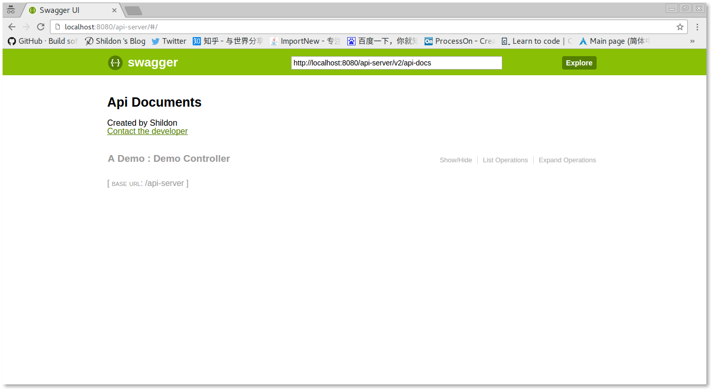
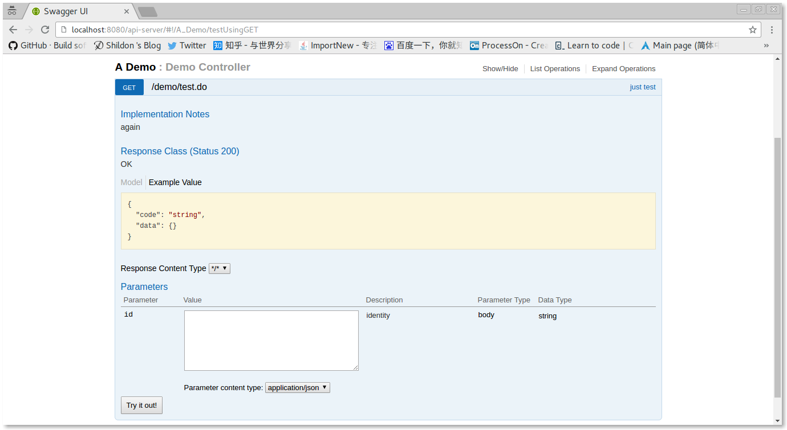

# api-server 

This is a demo for using springfox to generate api docs in springmvc project.

# Usage
### 1. Clone or Download the project.
### 2. Create a domain model in package com.shildon.api.model. Here is a example:

```java
@ApiModel("result")
public class AjaxResult {

	@ApiModelProperty("status code")
	private String code;
	@ApiModelProperty("model")
	private Object data;

	// getter and setter

}
```

### 3. Create a spring mvc controller in package com.shildon.api.controller.

```java
@Controller
@RequestMapping("/demo")
@Api(tags = "A Demo")
public class DemoController {

	@RequestMapping(value = "/test.do", method = RequestMethod.GET)
	@ResponseBody
	@ApiOperation(value = "just test", notes = "again")
	public AjaxResult test(@ApiParam("identity") String id) {
		return new AjaxResult();
	}

}
```

### 4. run `mvn tomcat:run`.
### 5. open browser and visit `http://localhost:8080/api-server`.

# ScreenShot


